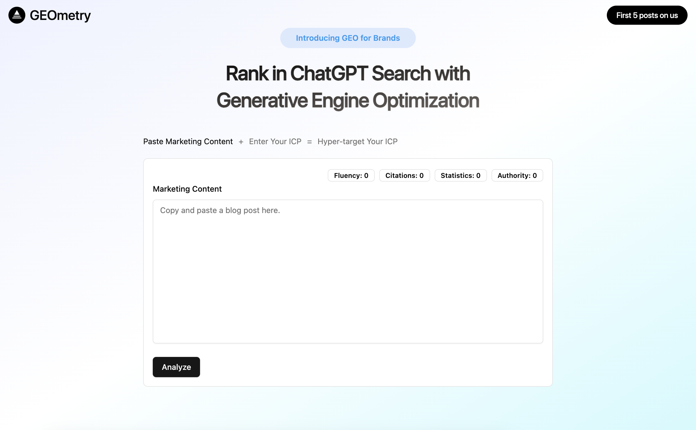
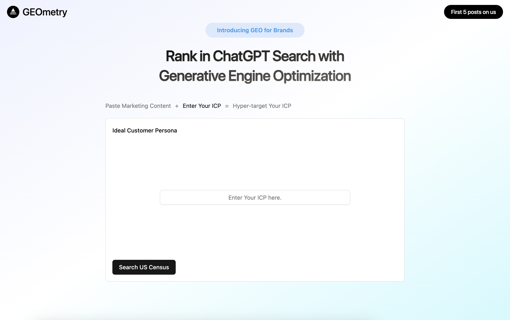

## GEOmetry

## Introduction

Goal is to find personas that are most similar to a given query for the purpose of personalized content recommendations.

## Screenshots

### Screen 1 (DONE)



Paste in marketing content (blogs, articles, etc.), get back recommendations on improving content according to proven GEO methods

### Screen 2 (DONE)



Explain which personas the content is meant for, get back similar personas to the one you explained, grounded in US Census Data.

```python

# Find personas by traits/skills
find_similar_personas("marketer who works in b2b saas and has analytical problem solving skills")
find_similar_personas("tech startup founder working in biotech")

# Find personas good for specific scenarios
find_similar_personas("helping with career advice")
```

### Screen 3 (WIP)

Get back a finished article with the content optimized for the personas you're optimizing for, grounded in US Census Data

### Backend

- [ChromaDB](https://www.chromadb.io/) – Vector database for semantic search
- [SentenceTransformers](https://www.sentence-transformers.net/) – Sentence embedding model for semantic search that is slower than other options but better quality for general cross-domain use. The project currently uses **all-mpnet-base-v2** for its better quality embeddings and ability to understand professional, lifestyle, and demographic concepts (aka understands semantic relationships across domains)
- [HuggingFace](https://huggingface.co/) – HuggingFace dataset for US Census Data

### UI

- [Next.js](https://nextjs.org/) – React framework for building performant apps with great developer experience
- [Tailwind CSS](https://tailwindcss.com/) – Utility-first CSS framework for rapid UI development
- [ShadCN](https://ui.shadcn.com/) – Beautifully simple, pixel-perfect components that means I don't have to rebuild components from scratch
- [Vercel](https://vercel.com/) – Easily preview & deploy changes with git

### Key Design Decisions

#### Multi-Persona Approach
- TLDR: Embed ALL the personas for max flexibility so you can use semantic search to find the most relevant ones regardless of persona type (sports persona vs professional persona, both are useful depending on the end user's ICP)
- Creates separate vector entries for each persona type per person
- Rich Context: combines related fields into the document for better embedding quality (professional persona also contains information about age, education, etc.)
- Enables precise semantic matching (e.g., "golf enthusiast" → sports_persona)
- Person Level Queries: preserves relationships through shared `person_uuid` for person level queries, relationships are preserved

#### Document Structure
- **Professional personas**: Role, skills, career focus, demographics
- **Lifestyle personas**: Activities, interests, life stage, background
- Structured text format for better embedding quality

#### Metadata Strategy
- Demographics for filtering (`age`, `location`, `education`)
- Persona relationships tracked via `person_uuid`
- Clean, frontend-ready field names

## Author

- Judith Lao